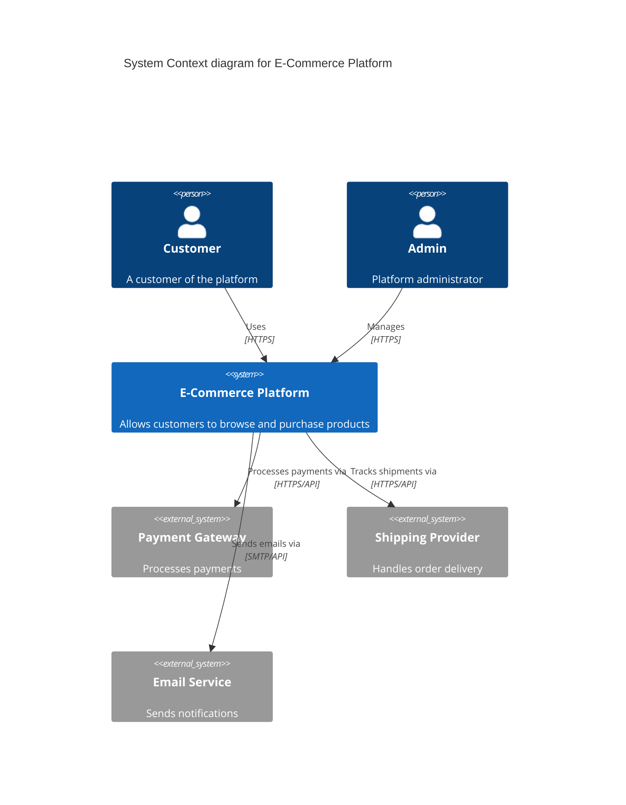

# ADR-0001: Adopt Microservices Architecture

## Status

Accepted

## Context

Our monolithic application has become difficult to maintain and scale. Different teams are working on different features, but they often block each other due to the shared codebase. We need to improve our ability to scale individual components independently and allow teams to work more autonomously.

Key considerations:
- Team autonomy and independence
- Independent scalability of components
- Technology diversity
- Deployment flexibility
- Operational complexity

## Decision

We will adopt a microservices architecture, breaking down our monolithic application into smaller, independent services that communicate via APIs.

### System Context

## Consequences

### Positive

- **Independent Deployment**: Teams can deploy their services independently without coordinating with other teams
- **Scalability**: Individual services can be scaled based on their specific load requirements
- **Technology Flexibility**: Teams can choose the best technology stack for their service
- **Fault Isolation**: Failures in one service don't necessarily bring down the entire system
- **Team Autonomy**: Teams have more ownership and can move faster

### Negative

- **Operational Complexity**: Need to manage multiple deployments, monitoring, and logging systems
- **Distributed System Challenges**: Must handle network latency, eventual consistency, and partial failures
- **Testing Complexity**: End-to-end testing becomes more complex
- **Data Consistency**: Maintaining data consistency across services requires careful design
- **Initial Development Overhead**: Setting up infrastructure and CI/CD pipelines for multiple services takes time

### Mitigation Strategies

- Implement comprehensive monitoring and observability tools
- Use API gateways for simplified client communication
- Adopt service mesh for inter-service communication management
- Establish clear service boundaries and contracts
- Invest in automated testing and deployment pipelines
