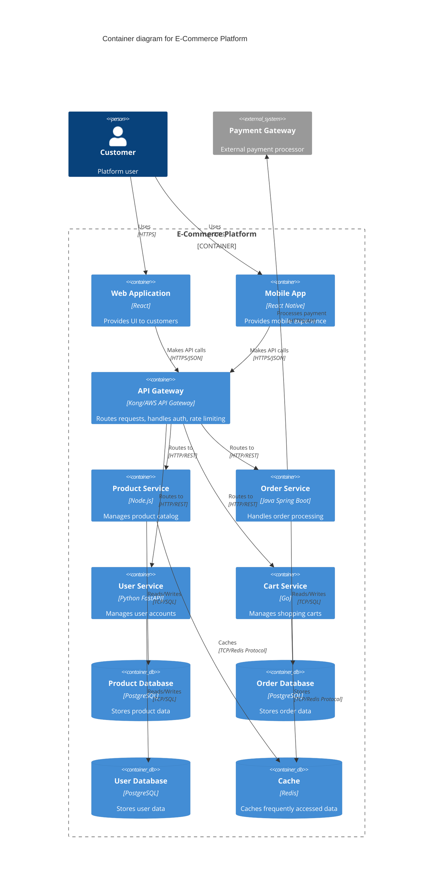

# ADR-0002: API Gateway Pattern for Microservices

## Status

Accepted

## Context

With our microservices architecture (as decided in ADR-0001), we face challenges:
- Clients need to know about multiple service endpoints
- Different services may use different protocols
- Cross-cutting concerns (authentication, rate limiting, logging) are duplicated
- Making changes to service endpoints impacts all clients

We need a solution that provides a single entry point for clients while managing the complexity of the backend microservices.

## Decision

We will implement an API Gateway pattern that serves as a single entry point for all client requests. The gateway will route requests to appropriate backend services and handle cross-cutting concerns.

### Container Architecture

## Consequences

### Positive

- **Single Entry Point**: Clients interact with one endpoint instead of multiple services
- **Simplified Client Code**: Clients don't need to know about service locations or handle service discovery
- **Centralized Cross-Cutting Concerns**: Authentication, logging, rate limiting handled in one place
- **Protocol Translation**: Gateway can translate between client-friendly protocols and internal protocols
- **Flexibility**: Can modify backend services without impacting clients
- **Security**: Provides an additional security layer

### Negative

- **Single Point of Failure**: Gateway becomes a critical component that needs high availability
- **Performance Bottleneck**: All traffic goes through the gateway
- **Complexity**: Adds another component to maintain and monitor
- **Configuration Management**: Gateway routing rules need to be kept in sync with services

### Mitigation Strategies

- Deploy gateway in a highly available configuration (multiple instances, load balanced)
- Implement comprehensive monitoring and alerting
- Use a proven, production-ready gateway solution (Kong, AWS API Gateway, etc.)
- Implement proper caching strategies to reduce load
- Set up automated configuration management and testing
