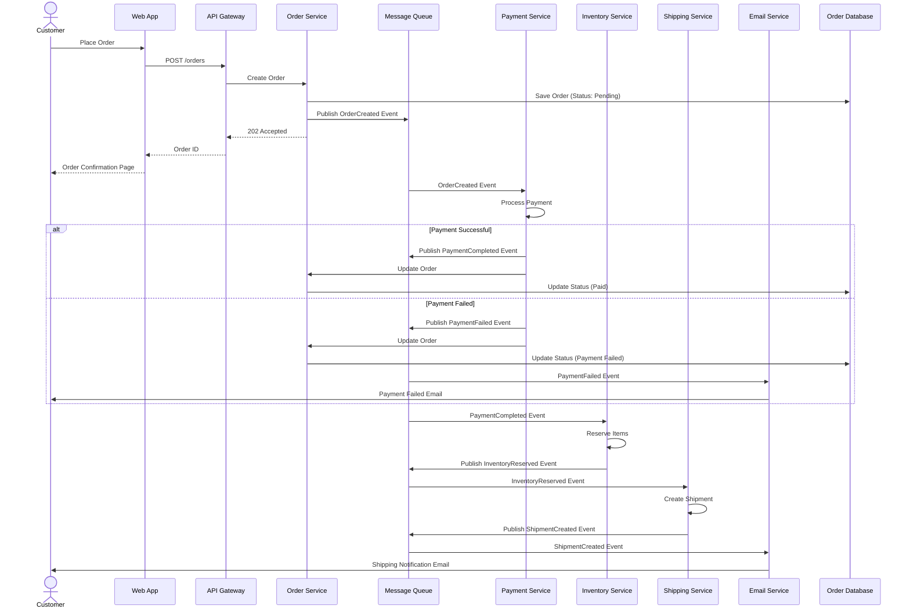

# ADR-0003: Event-Driven Order Processing

## Status

Accepted

## Context

Our order processing workflow involves multiple steps: payment processing, inventory reservation, shipping notification, and email confirmation. Currently, these are handled synchronously, which means:
- Long response times for customers
- If any step fails, the entire process fails
- Services are tightly coupled
- Difficult to add new processing steps

We need a more resilient and scalable approach to handle order processing.

## Decision

We will adopt an event-driven architecture for order processing. When an order is placed, an event is published, and various services consume and react to these events asynchronously.

### Order Processing Flow

## Consequences

### Positive

- **Asynchronous Processing**: Customers get immediate feedback without waiting for all steps
- **Resilience**: Failures in one service don't block others; can retry failed operations
- **Scalability**: Services can be scaled independently based on load
- **Loose Coupling**: Services communicate via events, not direct calls
- **Extensibility**: Easy to add new services that react to events
- **Audit Trail**: Event log provides complete history of order processing

### Negative

- **Eventual Consistency**: Order status may not be immediately up-to-date
- **Debugging Complexity**: Harder to trace requests across multiple services
- **Message Queue Dependency**: Queue becomes a critical component
- **Duplicate Processing**: Need to handle duplicate events (idempotency)
- **Ordering Guarantees**: May need to ensure events are processed in order

### Mitigation Strategies

- Implement comprehensive distributed tracing (using tools like Jaeger or Zipkin)
- Use correlation IDs to track events across services
- Ensure all event handlers are idempotent
- Implement dead letter queues for failed messages
- Use a reliable message queue system (RabbitMQ, Kafka, AWS SQS)
- Provide real-time status updates to customers via WebSockets or polling
- Implement proper monitoring and alerting for queue depths and processing times
