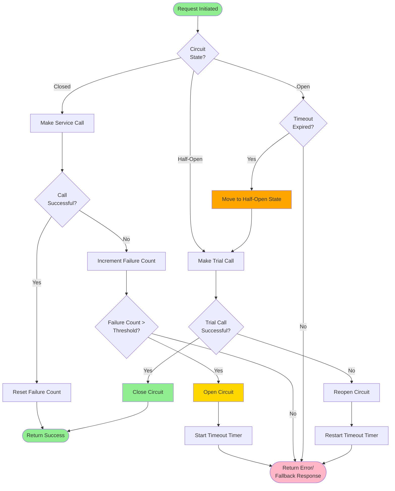

# ADR-0004: Circuit Breaker Pattern for Service Resilience

## Status

Accepted

## Context

In our microservices architecture, services depend on each other and external systems. When a downstream service fails or becomes slow, it can cause:
- Cascading failures throughout the system
- Resource exhaustion (threads waiting for timeouts)
- Poor user experience with long response times
- Difficulty in recovering from failures

We need a mechanism to handle failures gracefully and prevent cascading failures.

## Decision

We will implement the Circuit Breaker pattern for all inter-service and external system calls. The circuit breaker monitors for failures and "opens" (stops making calls) when failures reach a threshold, allowing the system to fail fast and recover gracefully.

### Circuit Breaker State Machine

### Circuit Breaker States

- **Closed**: Normal operation, requests flow through
- **Open**: Failures exceeded threshold, requests fail immediately
- **Half-Open**: Testing if service recovered, limited requests allowed

## Consequences

### Positive

- **Fast Failure**: System fails fast instead of waiting for timeouts
- **Prevents Cascading Failures**: Problems in one service don't cascade to others
- **Resource Protection**: Prevents resource exhaustion from waiting threads
- **Automatic Recovery**: Circuit can automatically close when service recovers
- **Improved User Experience**: Quick failures can return cached data or degraded functionality
- **System Stability**: Overall system remains stable even when components fail

### Negative

- **False Positives**: Circuit may open due to temporary issues
- **Configuration Complexity**: Need to tune thresholds and timeouts for each service
- **Monitoring Overhead**: Need to track circuit states across all services
- **Partial Functionality**: Users may experience degraded service
- **Testing Complexity**: Need to test failure scenarios and recovery

### Implementation Details

**Configuration Parameters:**
- Failure Threshold: Number of failures before opening circuit (e.g., 5)
- Timeout Duration: How long circuit stays open (e.g., 30 seconds)
- Success Threshold: Number of successful calls to close circuit (e.g., 2)
- Request Volume Threshold: Minimum number of requests before evaluating (e.g., 10)

**Fallback Strategies:**
- Return cached data
- Return default values
- Return error message to user
- Degrade functionality gracefully

### Mitigation Strategies

- Implement comprehensive monitoring of circuit breaker states
- Use proven libraries (Hystrix, Resilience4j, Polly)
- Configure appropriate thresholds based on SLAs and observed behavior
- Implement multiple fallback strategies
- Set up alerts for when circuits open
- Regularly test failure scenarios in staging environments
- Document circuit breaker behavior for each service
