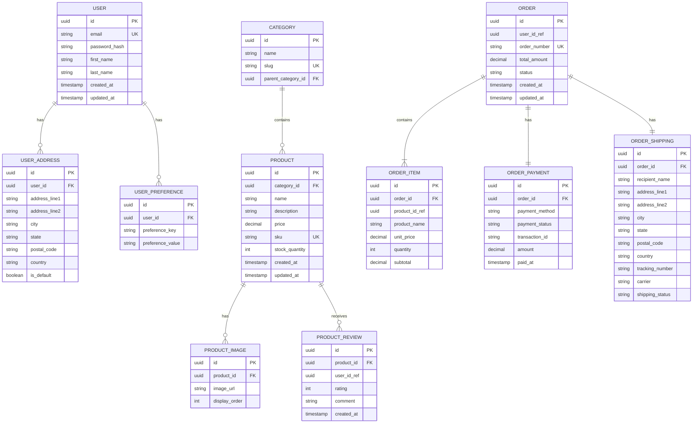

# ADR-0005: Database per Service Pattern

## Status

Accepted

## Context

In our microservices architecture, we need to decide how to manage data:
- Should services share a common database?
- How do we maintain service autonomy?
- How do we handle cross-service queries?
- How do we ensure data consistency?

Sharing a database between services creates tight coupling and defeats many benefits of microservices. However, separate databases introduce complexity around data consistency and cross-service queries.

## Decision

We will adopt the "Database per Service" pattern where each microservice has its own private database. Services cannot directly access other services' databases; they must use APIs or events.

### Data Model Overview

**Note**: Fields ending with `_ref` (like `user_id_ref`, `product_id_ref`) are references to entities in other services' databases. These are not foreign keys but cached identifiers used for display purposes.

## Consequences

### Positive

- **Service Autonomy**: Teams can change their database schema without affecting others
- **Independent Scaling**: Each database can be scaled based on its service's needs
- **Technology Diversity**: Services can use different database technologies (SQL, NoSQL)
- **Fault Isolation**: Database failure in one service doesn't affect others
- **Clear Ownership**: Each team owns their data completely
- **Better Performance**: No cross-service database locks or contention

### Negative

- **Data Duplication**: Some data needs to be replicated across services (cached references)
- **No Foreign Key Constraints**: Cannot enforce referential integrity across services
- **Complex Queries**: Cross-service queries require multiple API calls or event aggregation
- **Eventual Consistency**: Data across services may be temporarily inconsistent
- **Transaction Boundaries**: Cannot use ACID transactions across services
- **Increased Storage**: Same data may be stored in multiple databases

### Data Consistency Strategies

**1. Saga Pattern**
- Use choreography or orchestration for multi-service transactions
- Each service executes local transaction and publishes events
- Compensating transactions for rollbacks

**2. Event Sourcing**
- Store events rather than current state
- Services subscribe to events they need
- Rebuild state from events

**3. CQRS (Command Query Responsibility Segregation)**
- Separate read and write models
- Build optimized read models from events
- Allow eventual consistency for reads

**4. Data Synchronization**
- Use events to synchronize necessary data (e.g., product names in orders)
- Store local copies of frequently accessed foreign data
- Update cached data when source changes

### Mitigation Strategies

- Implement event-driven data synchronization for cached references
- Use saga pattern for distributed transactions
- Accept eventual consistency where possible
- Implement proper monitoring of data sync processes
- Document which data is authoritative and where it lives
- Use API calls for data that must be current
- Implement data validation at API boundaries
- Set up automated data consistency checks
- Use distributed tracing to debug cross-service data flows

### Service Data Ownership

- **User Service**: User accounts, addresses, preferences
- **Product Service**: Products, categories, reviews, inventory
- **Order Service**: Orders, order items (with cached product data), payments, shipping

Each service is the source of truth for its own data and publishes events when data changes that other services need to know about.
