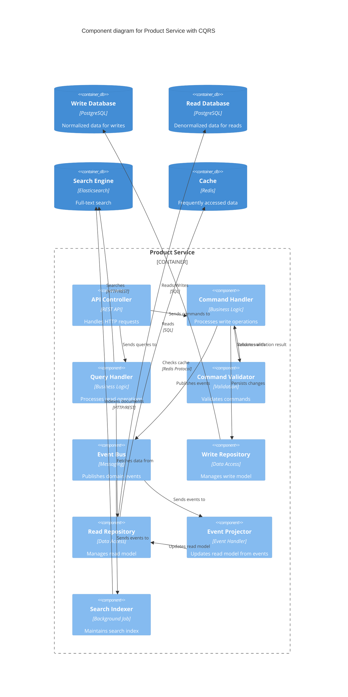

# ADR-0006: Implement CQRS Pattern for Product Catalog

## Status

Accepted

## Context

Our product catalog service handles both:
- High-volume read operations (browsing, searching, filtering)
- Lower-volume write operations (updates, new products)

The current approach has limitations:
- Complex queries slow down the database
- Read and write operations compete for resources
- Difficult to optimize for both reading and writing
- Scaling challenges (reads need caching, writes need consistency)

We need a way to handle reads and writes independently while maintaining good performance.

## Decision

We will implement the CQRS (Command Query Responsibility Segregation) pattern for the Product Catalog service, separating read and write operations into different models and potentially different data stores.

### Component Architecture

### Command Flow (Write Operations)

1. API receives command (e.g., CreateProduct, UpdatePrice)
2. Command Validator validates the command
3. Command Handler processes the command
4. Write Repository persists to Write Database
5. Event Bus publishes domain events
6. Command Handler returns success

### Query Flow (Read Operations)

1. API receives query (e.g., GetProductById, SearchProducts)
2. Query Handler checks cache first
3. If not cached, fetches from Read Database or Search Engine
4. Returns optimized read model to API

### Event Projection (Background)

1. Event Projector subscribes to domain events
2. Updates Read Database with denormalized data
3. Search Indexer updates Elasticsearch indices

## Consequences

### Positive

- **Optimized Reads**: Read model can be denormalized for fast queries
- **Optimized Writes**: Write model can be normalized for data integrity
- **Independent Scaling**: Scale reads and writes separately
- **Performance**: Reads don't impact writes and vice versa
- **Flexibility**: Different data stores for reads and writes if needed
- **Multiple Read Models**: Can have different read models for different use cases
- **Simplified Queries**: Complex joins in write model become simple lookups in read model

### Negative

- **Eventual Consistency**: Read model may lag behind write model
- **Increased Complexity**: More moving parts to maintain
- **Data Duplication**: Same data stored in multiple places
- **Operational Overhead**: More databases and services to monitor
- **Development Effort**: More code to write and maintain
- **Synchronization**: Need to keep read model in sync with write model

### Implementation Details

**Commands (Write Operations):**
- CreateProduct
- UpdateProductDetails
- UpdateProductPrice
- UpdateInventory
- DeleteProduct
- CreateCategory
- UpdateCategory

**Queries (Read Operations):**
- GetProductById
- GetProductsByCategory
- SearchProducts (full-text search)
- GetProductsWithFilters (price range, ratings, etc.)
- GetFeaturedProducts
- GetRelatedProducts

**Events:**
- ProductCreated
- ProductUpdated
- ProductPriceChanged
- InventoryUpdated
- ProductDeleted
- CategoryCreated
- CategoryUpdated

**Read Model Optimizations:**
- Denormalized data with category names included
- Pre-calculated average ratings
- Cached aggregations (product counts per category)
- Search-optimized text fields
- Multiple indexes for different query patterns

### Mitigation Strategies

- Set realistic expectations about eventual consistency (typically < 1 second)
- Implement version numbers or timestamps to detect stale reads
- Use cache invalidation strategically
- Monitor projection lag and alert if it exceeds threshold
- Implement retry logic for failed projections
- Provide "write-through" option for critical reads (query write model directly)
- Use optimistic UI updates to hide latency
- Implement proper error handling for projection failures
- Set up comprehensive monitoring of event processing
- Implement event replay capability for rebuilding read models

### When to Use CQRS

✅ **Good fit when:**
- Read and write workloads are significantly different
- Complex domain logic with many business rules
- Need for multiple denormalized read models
- High read-to-write ratio
- Performance is critical

❌ **Not recommended when:**
- Simple CRUD applications
- Read and write patterns are similar
- Team is unfamiliar with the pattern
- Small user base with simple requirements
