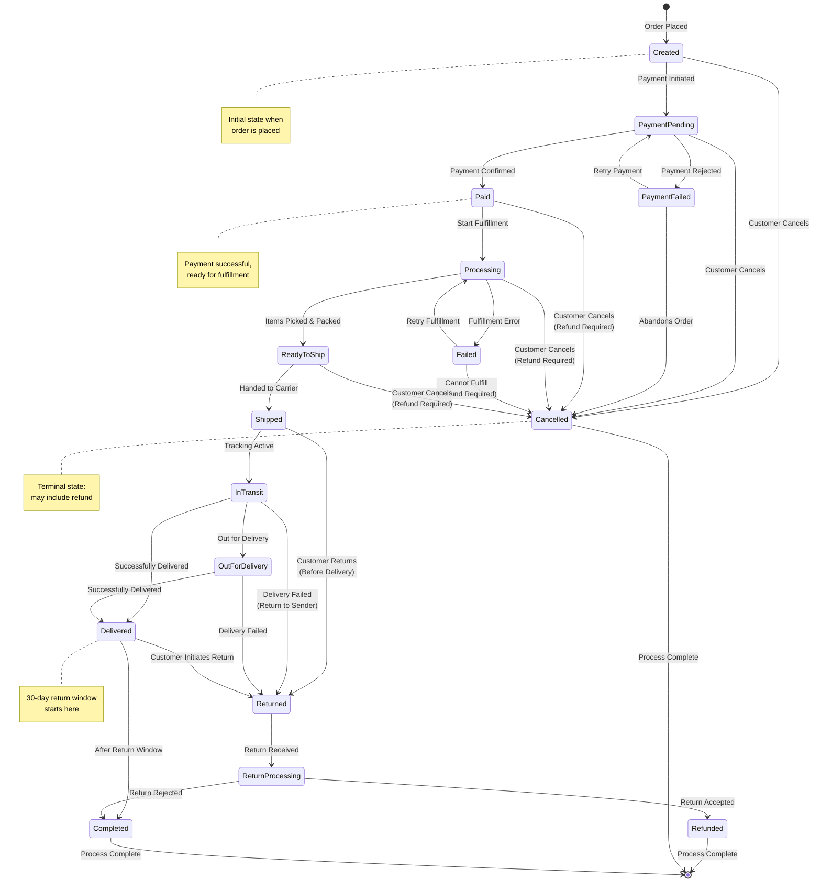

# ADR-0007: Order State Machine for Order Lifecycle Management

## Status

Accepted

## Context

Order processing involves multiple states and transitions as orders move through the fulfillment pipeline. Without a clear state machine, we face issues:
- Inconsistent order status updates
- Invalid state transitions (e.g., shipping a cancelled order)
- Difficulty handling edge cases and failures
- Confusion about what actions are valid for each state

We need a well-defined state machine to manage order lifecycle consistently.

## Decision

We will implement a formal state machine for order processing with clearly defined states, transitions, and guards. This will be enforced at the application level in the Order Service.

### Order State Machine



## Consequences

### Positive

- **Consistency**: All order state changes go through defined transitions
- **Validation**: Invalid state transitions are prevented at the code level
- **Clarity**: Everyone understands possible order states and transitions
- **Auditing**: Easy to track order history through state changes
- **Error Handling**: Clear handling of failure states and retries
- **Business Logic**: Guards can enforce business rules (e.g., return window)
- **Testing**: State machine is easier to test comprehensively

### Negative

- **Complexity**: More code to implement and maintain
- **Rigidity**: May be difficult to handle exceptional cases
- **Learning Curve**: Team needs to understand state machine pattern
- **Debugging**: Need tools to visualize current state and history

### State Definitions

**Created**: Order placed, awaiting payment
- **Actions**: Initiate payment, cancel
- **Guards**: None

**PaymentPending**: Payment in progress
- **Actions**: Confirm payment, retry payment, cancel
- **Guards**: Payment gateway timeout (5 minutes)

**PaymentFailed**: Payment declined or failed
- **Actions**: Retry payment, cancel
- **Guards**: Max retry attempts (3)

**Paid**: Payment successful
- **Actions**: Start processing, cancel with refund
- **Guards**: None

**Processing**: Order being fulfilled (picked, packed)
- **Actions**: Mark ready to ship, cancel with refund, mark failed
- **Guards**: None

**Failed**: Fulfillment failure (out of stock, warehouse error)
- **Actions**: Retry fulfillment, cancel with refund
- **Guards**: None

**ReadyToShip**: Order ready for carrier pickup
- **Actions**: Ship, cancel with refund
- **Guards**: None

**Shipped**: Handed to carrier
- **Actions**: Update tracking, mark in transit, return
- **Guards**: None

**InTransit**: Package in transit to customer
- **Actions**: Update location, mark out for delivery, mark delivered, return
- **Guards**: None

**OutForDelivery**: Package out for delivery
- **Actions**: Confirm delivery, return
- **Guards**: None

**Delivered**: Successfully delivered
- **Actions**: Complete (after window), initiate return
- **Guards**: Return window (30 days)

**Returned**: Customer returned the order
- **Actions**: Process return
- **Guards**: None

**ReturnProcessing**: Return received, being inspected
- **Actions**: Accept return (refund), reject return (complete)
- **Guards**: None

**Refunded**: Refund processed (terminal state)
- **Actions**: None (terminal)
- **Guards**: None

**Cancelled**: Order cancelled (terminal state)
- **Actions**: None (terminal)
- **Guards**: None

**Completed**: Order fulfilled, return window expired (terminal state)
- **Actions**: None (terminal)
- **Guards**: None

### Implementation Approach

**1. State Machine Library**
- Use a state machine library (e.g., Spring StateMachine, Stateless, XState)
- Or implement using State pattern

**2. Event Publishing**
- Publish events on state transitions
- Other services can react to state changes
- Events: OrderPaid, OrderShipped, OrderDelivered, OrderCancelled, etc.

**3. Persistence**
- Store current state with order
- Store state transition history in separate table
- Include timestamp, user, and reason for each transition

**4. Guards and Actions**
- Guards: Validate if transition is allowed
- Actions: Execute side effects (send emails, update inventory, process refunds)

**5. API Design**
```
POST /orders/{id}/transitions
{
  "event": "confirm_payment",
  "metadata": {
    "payment_id": "pay_123",
    "amount": 99.99
  }
}
```

### Mitigation Strategies

- Implement comprehensive logging of all state transitions
- Create admin tools to view state transition history
- Implement manual override capability for exceptional cases (with audit trail)
- Set up alerts for orders stuck in certain states
- Document all states, transitions, and business rules
- Create visualization tools for debugging
- Test all possible state transitions
- Handle concurrent state change attempts with optimistic locking
- Implement compensating transactions for failed transitions

### Benefits for Different Stakeholders

**Developers**: Clear contract for order state changes, easier to reason about code

**Customer Service**: Can see exactly where an order is and what actions are possible

**Customers**: Accurate real-time status updates

**Operations**: Can identify bottlenecks by analyzing state durations

**QA**: Can systematically test all state transitions
